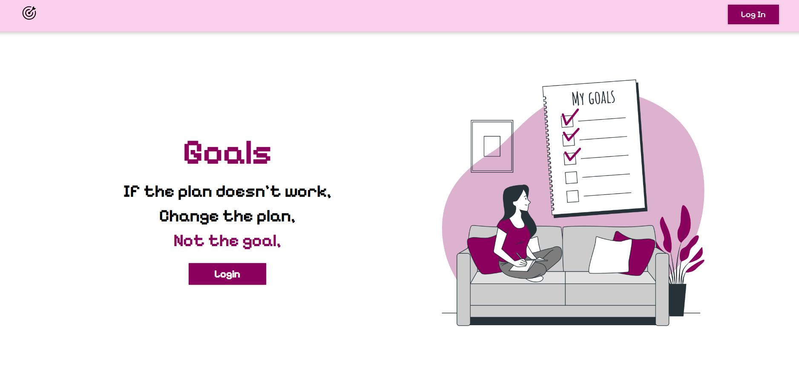
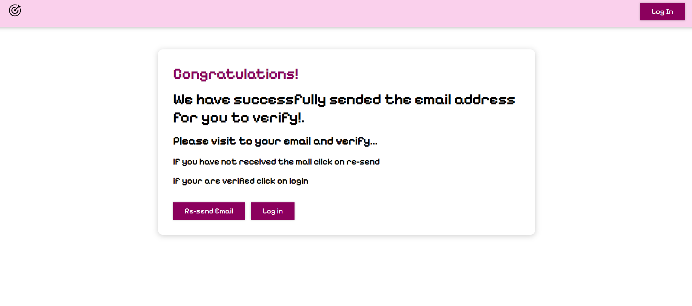
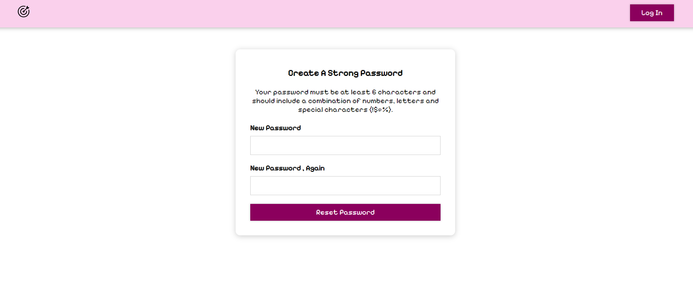
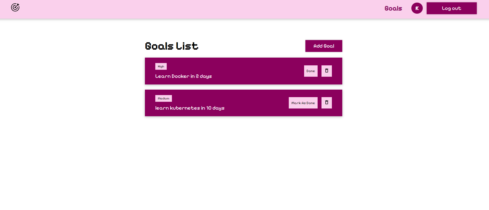
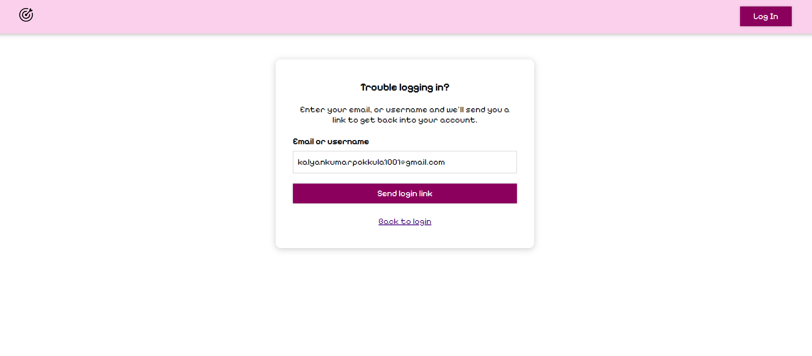
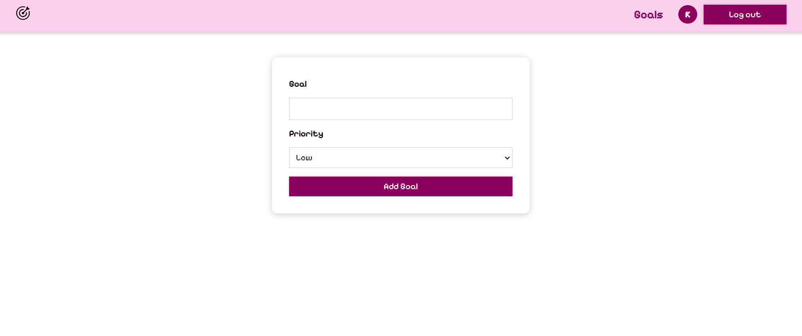

# Goals Tracker Application

## Description

This is a goals tracker application built using MERN stack (MongoDB, Express, React, and Node.js). It allows users to sign up, create, and delete goals.

## Features

- User authentication
- Goal creation
- Goal deletion

## Getting Started

To run the application locally, follow these steps:

1. Clone the repository:

```
git clone https://github.com/kalyanKumarPokkula/Goals_Fullstack.git
```

2. Install the dependencies for Client and Server Start the development server:

```
cd Client
npm install
npm run dev
cd ..
cd server
npm install
npm run dev
```

3. Open your browser and go to `http://localhost:3000` to access the application.

## Usage

To use the application, follow these steps:

1. Sign up for an account by clicking on the "Sign Up" link in the top right corner of the screen.
2. Enter your email address and a password, and then click on the "Sign Up" button.
3. Once you have signed up, you will be redirected to the goals page.
4. To create a new goal, click on the "Add Goal" button.
5. Enter a title and a description for your goal, and then click on the "Create Goal" button.
6. Your goal will be added to the list of goals.
7. if goal is completed you can click on the "markAsDone" button next to the goal.
8. To delete a goal, click on the "Delete" button next to the goal.

## Tech Stack

The following technologies were used to build this application:

- MongoDB: A document-oriented database used to store the goals.
- Express: A web framework for Node.js used to create the RESTful API.
- React: A JavaScript library for building user interfaces.
- Node.js: A JavaScript runtime environment used to run the application.

## Environment Variables

     This project requires certain environment variables to run. Please create a `.env` file based on the `.env.example` file provided in the Server directory of the project.

     The `.env.example` file contains the following environment variables:

     - `DB_URL`: The port of the database server.
     - `PORT`: Port number example: 3000.
     -
     ```

## Screenshots

### Homepage



### login Page


### signup page


### verfiy page


### successverificationpage



### reset-password page



### goals list page



### forgot-password page



### Add New Goal page



## Contributing

Contributions are welcome! Please read the [contributing](https://github.com/kalyanKumarPokkula/Goals_Fullstack) before submitting a pull request.

## License

This project is licensed under the MIT License.
